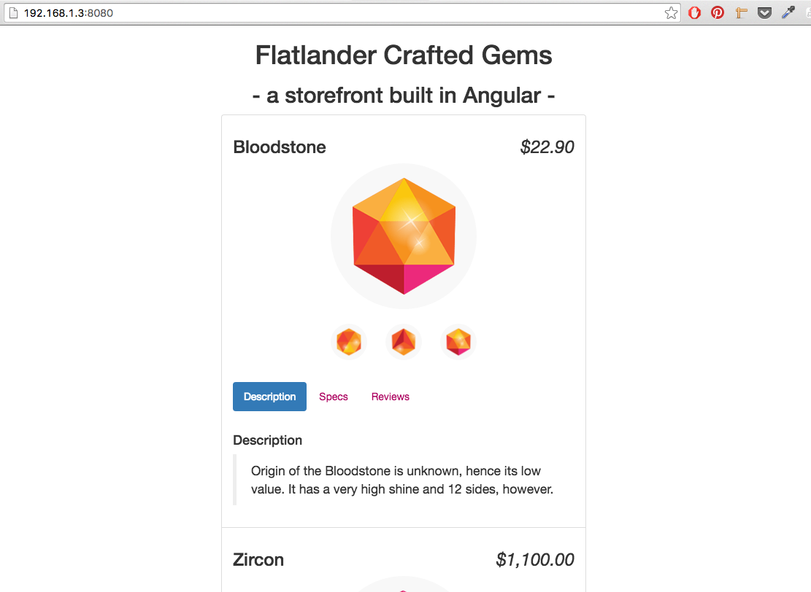

#Angular Project: Frontend Storefront

This is a simple storefront made with AngularJS.  I completed this project by following the Codeschool tutorial "Shaping Up with Angular".  

This tutorial is available for free at:

[https://www.codeschool.com/courses/shaping-up-with-angular-js](https://www.codeschool.com/courses/shaping-up-with-angular-js)

It's a really fun tutorial that covers a lot of the basics of AngularJS.  The explanations are helpful and the concepts are explained clearly.  

There is also an excellent discussion forum for additional support should you get stuck with anything.

## Features

- AngularJS modules
- Dependency injection (e.g. custom store directives are injected into the app's 'gemStore' module)
- JSON data
- Twitter Bootstrap and custom CSS styling
- Custom element and attribute directives to refactor index.html file
- Interactive image gallery
- Interactive product review functionality
- AngularJS form validation

## Instructions

1. Fork this repo.

2. Clone this repo to your machine.

3. [Install node](https://nodejs.org/en/) and [http-server](https://github.com/indexzero/http-server) using [npm](https://www.npmjs.com/).

4. Open your command line and run:

 ``http-server [path to your local repo of this repo]``

5. Open your browser of choice and navigate to the IP address returned in your command line to view the app.

6. This is what the app should look like when running locally:

